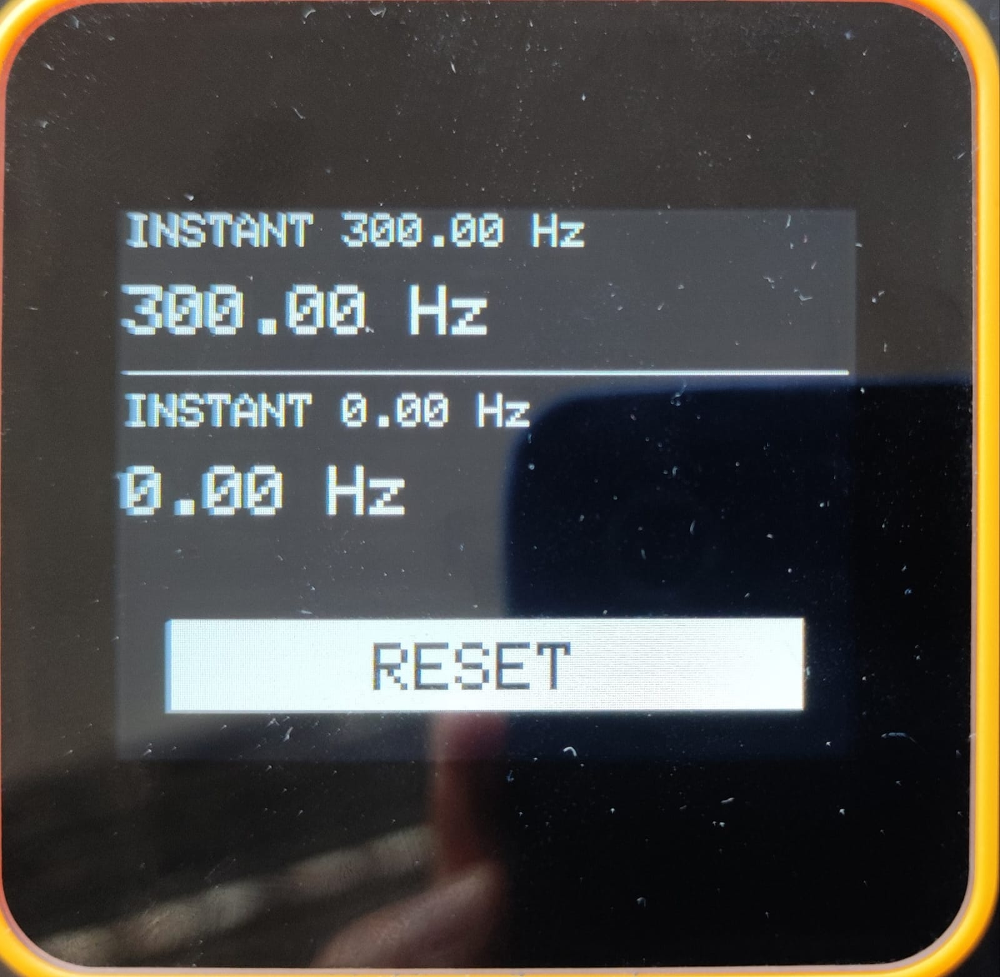

# M5Tough_FlowMeasurement

M5Tough_FlowMeasurement is a project based on the M5Stack TOUGH ESP32 microcontroller designed to measure liquid flow one or more flow sensors. The measured results are displayed in real-time on the device's screen.

## Description

This project utilizes liquid flow sensors connected to the M5Stack TOUGH ESP32 microcontroller to monitor and display the flow rate in Hertz (Hz) for one or more sensors. The view is currently prepared for two measurements.
The code leverages interrupts and timers of the ESP32 for accurate pulse counting from the flow sensors, ensuring precise measurement results.
The timer is configured with a precision of 100 milliseconds (ms).
Measurements are averaged over the last 10 samples to smooth out fluctuations in the flow rate. Initially, the average is calculated progressively as more samples are collected to stabilize the readings.
The screen displays the flow rate both as an averaged value and as an instant measurement for each connected sensor.
A reset button on the screen allows the user to reset all counters and measurements.

GPIO interrupt handling was tested up to 100 kHz; at 101 kHz, signal integrity issues were observed.

## Features

- Real-time monitoring of liquid flow rate for up to two sensors
- Utilization of ESP32 interrupts and timers for precise pulse counting from the flow sensors
- Averaging of flow measurements over the last 10 samples to reduce noise
- Displaying flow rate in Hertz (Hz) on the M5Stack TOUGH screen for each sensor
- Reset button for resetting all counters and measurements

## Hardware Requirements

- M5Stack TOUGH ESP32 microcontroller
- One or more flow sensors sensor with pulse output
- Connecting wires

## Installation

1. Open the project in Arduino IDE.
2. Ensure you have the following libraries installed:
    - M5Unified
    - Arduino.h (ESP32 core)
3. Configure the appropriate board settings in the Arduino IDE for M5Stack TOUGH ESP32.
4. Upload the code to the M5Stack TOUGH ESP32 device.

## Usage

1. Connect the flow sensors to the designated GPIO pins on the M5Tough and change the GPIO pin number in lines 10 and 11 in the M5Tough file.
```cpp
#define SENSOR_PIN_1    2
#define SENSOR_PIN_2    36
```
2. Power on the device.
3. The flow rate for each sensor will be displayed on the M5Stack TOUGH screen in real-time. The displayed values include the averaged flow rate and the instantaneous measurement for each sensor.
4. Use the on-screen reset button to clear all measurements and start fresh as needed.



## GPIO list
|                    |M5Stack Core2(AWS) Tough               |
|:------------------:|:-------------------------------------:|
|GPIO 0<BR>`ADC2_CH1`|`M-Bus`<BR>**SPK_LRCK<BR>PDM_C**(Core2)|
|GPIO 1<BR>`USB_TX`  |`M-Bus`<BR>**Serial**                  |
|GPIO 2<BR>`ADC2_CH2`|`M-Bus`<BR>**SPK_D**                   |
|GPIO 3<BR>`USB_RX`  |`M-Bus`<BR>**Serial**                  |
|GPIO 4<BR>`ADC2_CH0`|**TF_CS**                              |
|GPIO 5              |**LCD_CS**                             |
|GPIO 9              | ---                                   |
|GPIO10              | ---                                   |
|GPIO12<BR>`ADC2_CH5`|**SPK_BCLK**                           |
|GPIO13<BR>`ADC2_CH4`|`M-Bus`<BR>RXD2                        |
|GPIO14<BR>`ADC2_CH6`|`M-Bus`<BR>TXD2                        |
|GPIO15<BR>`ADC2_CH3`|**LCD_D/C**                            |
|GPIO16<BR>`PSRAM`   | ---                                   |
|GPIO17<BR>`PSRAM`   | ---                                   |
|GPIO18              |**SPI_SCLK**                           |
|GPIO19              |`M-Bus`                                |
|GPIO21              |**I2C1_SDA**                           |
|GPIO22              |**I2C1_SCL**                           |
|GPIO23              |**SPI_MOSI**                           |
|GPIO25<BR>`DAC1`    |`M-Bus`<BR>**RGB LED**(AWS)            |
|GPIO26<BR>`DAC2`    |`M-Bus`                                |
|GPIO27<BR>`ADC2_CH7`|`M-Bus`                                |
|GPIO32<BR>`ADC1_CH4`|`M-Bus`<BR>`PORT.A`<BR>I2C0_SDA        |
|GPIO33<BR>`ADC1_CH5`|`M-Bus`<BR>`PORT.A`<BR>I2C0_SCL        |
|GPIO34<BR>`ADC1_CH6`|`M-Bus`<BR>**PDM_D**(Core2)            |
|GPIO35<BR>`ADC1_CH7`|`M-Bus`                                |
|GPIO36<BR>`ADC1_CH0`|`M-Bus`                                |
|GPIO37<BR>`ADC1_CH1`| ---                                   |
|GPIO38<BR>`ADC1_CH2`|`M-Bus`<BR>**SPI_MISO**                |
|GPIO39<BR>`ADC1_CH3`|**TP_INT**                             |
